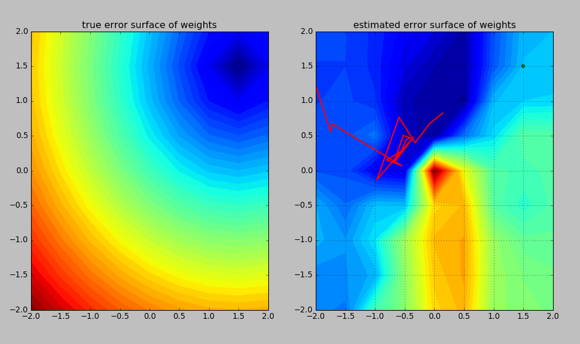
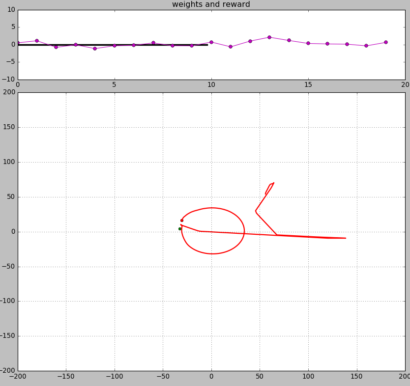

# Quick Start

## Obtain requirements

* `numpy`
* `sklearn`
* `matplotlib`

## Install with

```
	$ python setup.py install
```

## Run the demos

### A supervised learning problem 

```
	python demo_supervised.py
```



### Using reinforcement learning

```
	python demo_reinforcement.py
```


